

# Introduction to Backend Architectures

Learn about **architectural** backend design principles, challenges, real-world applications, while offering a detailed understanding of when and how to implement them.

---

# Introduction to Teacher

---

# Introduction to Teacher

## Erik Reinert aka "Blackglasses"

- Senior Software Engineer
- Content Creator (@TheAltF4Stream on Twitch and YouTube)
- Diagram & Flowchart Artist
- Habitual Problem Solver

---

# Introduction to Teacher

## Erik Reinert aka "Blackglasses"

Find me online:

- Engineering Blog: https://altf4.blog
- Twitch: https://www.twitch.tv/thealtf4stream
- Twitter: https://www.x.com/thealtf4stream
- YouTube: https://www.youtube.com/thealtf4stream

---

# Introduction to Teacher

## Experience Paths

- Started with frontend (2+ years)
- Followed curiosity to backend (2+ years)
- Continued curiosity to fullstack (2+ years)
- Found passion in DevOps & Platform Engineering (4+ years - current)

---

# Introduction to Teacher

## Existing Courses

### Introduction to DevOps for Developers

> Take your first steps into DevOps guided from the perspective of a developer! Improve software teams’ ability to build and ship software reliably.

---

# Introduction to Teacher

## Existing Courses

### Enterprise Cloud Infrastructure

> Learn to set up large-scale systems with GitOps and optimized CI/CD workflows. And see strategies to standardize your organization's approach to AWS resource management and dynamic cloud orchestration.

---

# Introduction to Teacher

## Should I watch "Introduction to DevOps for Developers" course?

---

# Introduction to Teacher

## Should I watch "Enterprise Cloud Infrastructure" course?

---

# Introduction to Course

---

# Introduction to Course

## Goals in this course are

- Define "what" backend system architecture designs are
- Define "when" to use backend system architecture designs
- Define "how" to implement backend system architecture designs

---

# Introduction to Course

## Goals in this course are

- Explore "common" backend system architecture designs
- Show "evolution" of a backend's system architecture

---

# Introduction to Course

## Are there pre-requisites for this course?

- Basic understanding of software development
- Basic understanding of backends vs. frontends
- Basic understanding of how to create backends

---

# What are Backend Architecture Designs?

---

# What are Backend Architecture Designs?

## Quote from AI

> "Success begins with understanding. Before we lay a single brick, it is crucial that we fully grasp the blueprint, for a thorough comprehension of the foundation leads to a structure that stands the test of time."

---

# What are Backend Architecture Designs?

## Definition

- The process of defining the modularity, interfaces, and data flow for a system to satisfy specified requirements.

---

# What are Backend Architecture Designs?

## Importance

- Architecture designs provide a structured approach to solving complex problems, making it easier to understand and manage the overall system.

---

# What are Backend Architecture Designs?

## Importance

- Architecture designs facilitate communication among team members by providing a common language and reference.

---

# What are Backend Architecture Designs?

## Importance

- Architecture designs can improve efficiency and productivity by reducing redundancy and facilitating code reuse.

---

# What are Backend Architecture Designs?

## Importance

- Architecture designs play a key role in ensuring that the final product meets user needs and business objectives.

---

# What are Backend Architecture Designs?

## Key Principles

- Modularity
- Scalability
- Robustness
- Flexibility

---

# What are Backend Architecture Designs?

## Key Principles

### Modularity

- Each component of the system should have a specific task.

---

# What are Backend Architecture Designs?

## Key Principles

### Scalability

- Systems should be designed to handle growth of traffic.

---

# What are Backend Architecture Designs?

## Key Principles

### Robustness

- Systems should be able to handle errors or unexpected situations.

---

# What are Backend Architecture Designs?

## Key Principles

### Flexibility

- Systems should be designed to accommodate changes or future features.

---

# What are Backend Architecture Designs?

## Key Challenges

- Complexity
- Adaptability
- Security
- Technology
- Resources
- Stakeholders

---

# What are Backend Architecture Designs?

## Key Challenges

### Complexity

- Handling the intricate details and interdependencies in a system can be complex.

---

# What are Backend Architecture Designs?

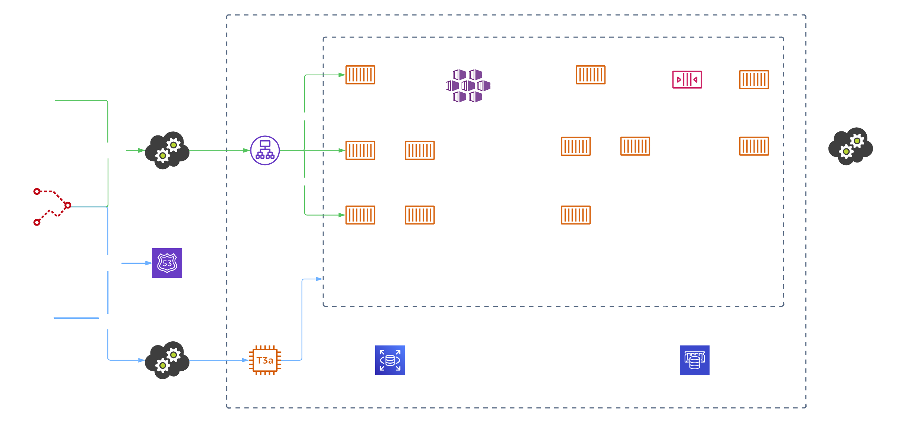

---

# What are Backend Architecture Designs?

## Key Challenges

### Adaptability

- Designing systems that can adapt to changing business needs is challenging.

---

# What are Backend Architecture Designs?

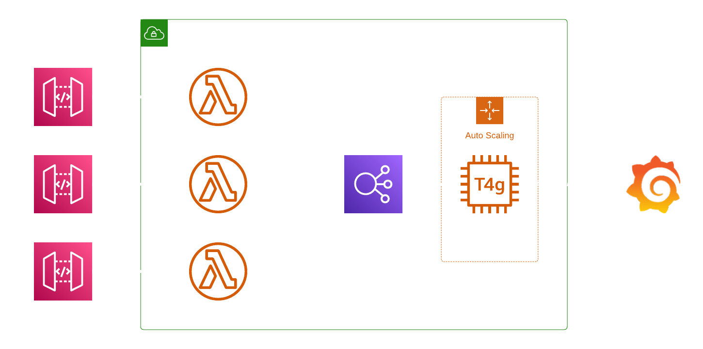

---

# What are Backend Architecture Designs?

## Key Challenges

### Security

- Ensuring the security of data and processes within the system is a constant concern.

---

# What are Backend Architecture Designs?

## Key Challenges

### Technology Choices

- Choosing the right technology stack for the system is crucial and can be difficult.

---

# What are Backend Architecture Designs?

## Key Challenges

### Resource Management

- Allocating the right resources for the system's development and maintenance can be a challenge.

---

# What are Backend Architecture Designs?

## Key Challenges

### Stakeholder Alignment

- Getting all stakeholders to agree on the system's design can sometimes be a difficult task.

---

# When to use Backend Architecture Designs?

---

# When to use Backend Architecture Designs?

## Quote from AI

> "The right time to act is not simply found, but felt. It arises at the intersection of preparation and intuition, where opportunity's whisper becomes too compelling to ignore."

---

# When to use Backend Architecture Designs?

- Understanding "when" to use
- Factoring "when" to use
- Considering "when" to use

---

# When to use Backend Architecture Designs?

## Understanding

- When starting a new project, as "greenfield" scenarios allow for a structured approach from the beginning.

---

# When to use Backend Architecture Designs?

## Understanding

- When scaling an existing system, system designs can be used to identify bottlenecks and areas for improvement.

---

# When to use Backend Architecture Designs?

## Understanding

- When there are complex problems that need to be broken down into manageable parts.

---

# When to use Backend Architecture Designs?

## Understanding

- When there is a need for improved efficiency and productivity - system designs help in reducing redundancy and facilitating code reuse.

---

# When to use Backend Architecture Designs?

## Understanding

- When there is a need for better communication among team members - system designs provide a common language and reference.

---

# When to use Backend Architecture Designs?

## Factoring

### Project Requirements

- The functionality, performance, security, and scalability needs of the project.

---

# When to use Backend Architecture Designs?

## Factoring

### Team Expertise

- The experience and skill set of the development team can influence the choice of system design.

---

# When to use Backend Architecture Designs?

## Factoring

### Budget

- Certain designs may require more resources, affecting the cost of the project.

---

# When to use Backend Architecture Designs?

## Factoring

### Time Constraints

- Some designs may take longer to implement than others.

---

# When to use Backend Architecture Designs?

## Factoring

### Project Size and Complexity

- Larger and more complex projects may benefit from certain system designs.

---

# When to use Backend Architecture Designs?

## Factoring

### Maintenance

- The ease of maintaining and updating the system can influence the choice of design.

---

# When to use Backend Architecture Designs?

## Considering

### Technological Choices

- Keeping track of the latest technological trends can influence the choice of system design.

---

# When to use Backend Architecture Designs?

## Considering

### User Feedback

- Incorporating feedback from users can help improve the system design.

---

# When to use Backend Architecture Designs?

## Considering

### Market Trends

- Understanding the demands and trends of the market can also affect the choice of system design.

---

# When to use Backend Architecture Designs?

## Considering

### Legal and Regulatory Requirements

- Compliance with laws and regulations may dictate certain aspects of the system design.

---

# How to implement Backend Architecture Designs?

---

# How to implement Backend Architecture Designs?

## Quote from AI

> "Mastering something isn't a matter of precise science; it's a craft honed through the persistent trial of experience, learning and adapting as we navigate the ever-unfolding journey."

---

# How to implement Backend Architecture Designs?

## Design Stages

1. Research
2. Implement
3. Iterate

---

# How to implement Backend Architecture Designs?

## Research

### Setting Requirements

- Identify the primary purpose and scope of the system.

---

# How to implement Backend Architecture Designs?

## Research

### Setting Requirements

- Understand the needs and expectations of the end-users of the system.

---

# How to implement Backend Architecture Designs?

## Research

### Setting Requirements

- Determine the functionality that the system needs to provide to meet the end-users' needs.

---

# How to implement Backend Architecture Designs?

## Research

### Setting Requirements

- Specify the performance levels that the system needs to achieve.

---

# How to implement Backend Architecture Designs?

## Research

### Setting Requirements

- Identify any constraints or limitations, such as budget, resources, or time.

---

# How to implement Backend Architecture Designs?

## Research

### Setting Requirements

- Consider the scalability needs of the system - how it can grow and adapt to increased demand.

---

# How to implement Backend Architecture Designs?

## Research

### Setting Requirements

- Determine any security requirements to protect data and processes within the system.

---

# How to implement Backend Architecture Designs?

## Research

### Setting Requirements

- Identify any regulatory or compliance requirements that the system needs to meet.

---

# How to implement Backend Architecture Designs?

## Research

### Setting Requirements

- Specify the requirements for integrating the new system with existing systems.

---

# How to implement Backend Architecture Designs?

## Research

### Exploration

- Research and testing of new technologies.

---

# How to implement Backend Architecture Designs?

## Research

### Exploration

- Experimenting with new methodologies and tools.

---

# How to implement Backend Architecture Designs?

## Research

### Exploration

- Determine if the goal is to improve the system design entirely (innovation) or make small changes where needed (iteration).

---

# How to implement Backend Architecture Designs?

## Research

### Technical Documents

- Used for understanding possible explored solutions or ideas which keep the project on path.

---

# How to implement Backend Architecture Designs?

## Research

### Technical Documents

- Provide detailed descriptions of the explored systems, including architectures, modules, interfaces, and data relevant to the project.

---

# How to implement Backend Architecture Designs?

## Research

### Technical Documents

- Reference for the development team and other stakeholders.

---

# How to implement Backend Architecture Designs?

## Research

### Technical Documents

- Facilitate communication and collaboration.

---

# How to implement Backend Architecture Designs?

## Implementing Systems Designs

- Chose the appropriate design
- Define the architecture
- Develop the architecture
- Test the architecture
- Deploy the architecture
- Maintain the architecture

---

# How to implement Backend Architecture Designs?

## Implementing Systems Designs

### Chose the appropriate design

- Choose the systems design that best fits the project requirements, team expertise, budget, and time constraints outlined in technical documents mentioned.

---

# How to implement Backend Architecture Designs?

## Implementing Systems Designs

### Define the Architecture

- Document the system’s architecture, including its modules, interfaces, and data.

---

# How to implement Backend Architecture Designs?

## Implementing Systems Designs

### Develop the Architecture

- Begin the development process, ensuring that each component of the architecture is working on its specific task.

---

# How to implement Backend Architecture Designs?

## Implementing Systems Designs

### Test the Architecture

- Conduct rigorous testing to identify and fix any bugs or issues and to ensure that the architecture meets the project requirements.

---

# How to implement Backend Architecture Designs?

## Implementing Systems Designs

### Deploy the Architecture

- Once the architecture passes all tests, deploy it in a controlable production environment.

---

# How to implement Backend Architecture Designs?

## Implementing Systems Designs

### Maintain the Architecture

- Regularly update and maintain the architecture to ensure its ongoing effectiveness and to accommodate any changes in project requirements or business needs.

---

# How to implement Backend Architecture Designs?

## Best Practices

- Involve all stakeholders from the beginning to ensure their needs and expectations are met.

---

# How to implement Backend Architecture Designs?

## Best Practices

- Use a modular approach to keep the system manageable and understandable.

---

# How to implement Backend Architecture Designs?

## Best Practices

- Plan for scalability from the beginning to prepare for future growth.

---

# How to implement Backend Architecture Designs?

## Best Practices

- Design systems to be robust and flexible to handle errors or unexpected inputs and accommodate changes.

---

# How to implement Backend Architecture Designs?

## Best Practices

- Consider security needs throughout the design and development process.

---

# How to implement Backend Architecture Designs?

## Best Practices

- Keep up with the latest technological trends to make informed design decisions.

---

# How to implement Backend Architecture Designs?

## Best Practices

- Incorporate feedback from users to improve the system design.

---

# Common Backend System Architectures

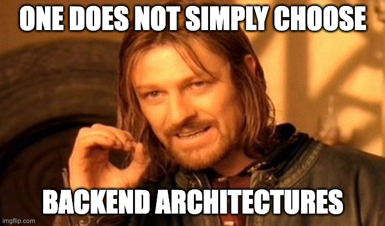

---

# Common Backend System Architectures

## Three commonly used architectures

- Monolithic
- Distributed (service-oriented)
- Serverless

---

# Common Backend System Architectures

## Monolithic

---

# Common Backend System Architectures

## Monolithic

### Definition

Monolithic architecture is a model where all the necessary code and components for a software application are combined into a single unit.

---

# Common Backend System Architectures

## Monolithic

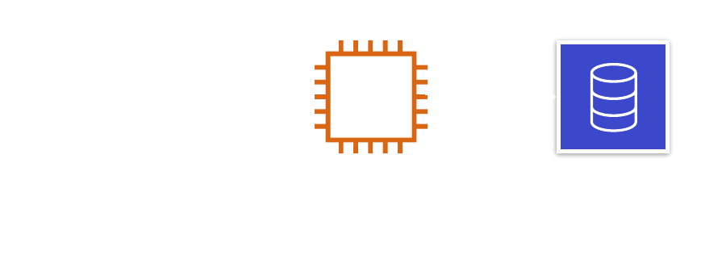

---

# Common Backend System Architectures

## Monolithic

### Overview

Monolithic architecture has all functionalities tightly coupled, running in the same system.

---

# Common Backend System Architectures

## Monolithic

### Overview

This architecture is simple to develop, test, and deploy due to its unified system.

---

# Common Backend System Architectures

## Monolithic

### Pros

- **Simplicity:** Easier to develop, test, and deploy due to unified system.

---

# Common Backend System Architectures

## Monolithic

### Pros

- **Consistency:** Allows for uniformity in handling requests as every module uses the same set of procedures.

---

# Common Backend System Architectures

## Monolithic

### Pros

- **Efficiency:** Since all the functionalities are interconnected, it can be more efficient in terms of inter-process communication.

---

# Common Backend System Architectures

## Monolithic

### Cons

- **Limited Scalability:** Scaling specific functions of a system is not possible. The entire system needs to be scaled.

---

# Common Backend System Architectures

## Monolithic

### Cons

- **Lack of Flexibility:** Changes to a single component can require the entire system to be redeployed.

---

# Common Backend System Architectures

## Monolithic

### Cons

- **Complexity:** The system can become too complex and hard to manage as the application grows.

---

# Common Backend System Architectures

## Monolithic

### Use Cases

- **Small-scale applications:** Given its simplicity, a monolithic architecture is often suitable for small-scale applications or startups where the application's scope is clear and unlikely to drastically change or scale.

---

# Common Backend System Architectures

## Monolithic

### Use Cases

- **Applications with simple, well-defined business processes:** Monolithic architecture can be beneficial in scenarios where the business processes are simple and unlikely to require significant changes or additions.

---

# Common Backend System Architectures

## Monolithic

### Use Cases

- **Applications where high performance is critical:** Since all functionalities are interconnected, a monolithic architecture can provide faster inter-process communication compared to other architectures.

---

# Common Backend System Architectures

## Distributed (service-oriented)

---

# Common Backend System Architectures

## Distributed (service-oriented)

### Definition

- Generic services and/or microservices architecture is a method of developing software systems that are loosely coupled and independently deployable smaller services, which run in their own processes.

---

# Common Backend System Architectures

## Distributed (service-oriented)

### Overview

- This architecture allows for continuous delivery and deployment of large, complex applications. It also enhances an organization's capability to innovate and reduces the time to market for new features.

---

# Common Backend System Architectures

## Distributed (service-oriented)

### Definition

- **"Generic services"** often refers to a component of an application that provides specific functionality for the platform.

- **"Generic services"** could be part of a monolithic application where all services run within the same process, or it could be part of a distributed system where services may run in separate processes or on separate machines.

---

# Common Backend System Architectures

## Distributed (generic services)

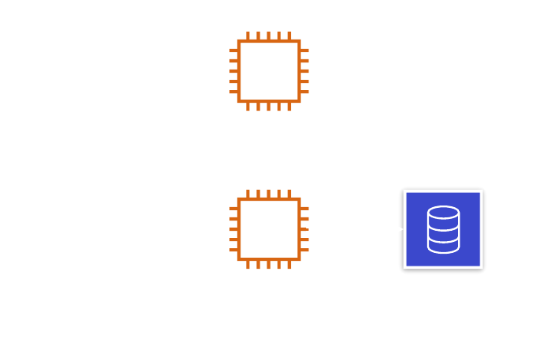

---

# Common Backend System Architectures

## Distributed (microservices)

### Definition

- **"Microservices"** are a specific style of service-based architecture. In a microservices architecture, each service is small, independent, and loosely coupled.

- **"Microservices"** run in their own process and communicate with other "services" using protocols such as HTTP/REST or messaging queues. They can be developed, deployed, and scaled independently, which offers more flexibility than traditional service architectures.

---

# Common Backend System Architectures

## Distributed (microservices)

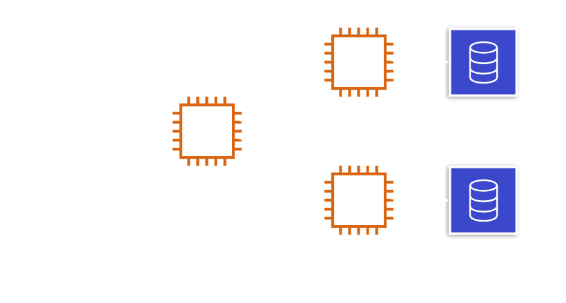

---

# Common Backend System Architectures

## Distributed (service-oriented)

### Pros

- **Independent Development:** Each service can be developed independently by a team that is focused on that service.

---

# Common Backend System Architectures

## Distributed (service-oriented)

### Pros

- **Independent Deployment:** Services can be deployed independently.

---

# Common Backend System Architectures

## Distributed (service-oriented)

### Pros

- **Fault Isolation:** A process failure should not bring the whole system down.

---

# Common Backend System Architectures

## Distributed (service-oriented)

### Pros

- **Mixed Technology Stack:** Different services can use different technologies.

---

# Common Backend System Architectures

## Distributed (service-oriented)

### Cons

- **Distributed System Complexity:** Developers must deal with the additional complexity of creating a distributed system.

---

# Common Backend System Architectures

## Distributed (service-oriented)

### Cons

- **Development and Testing:** Writing and testing applications is more difficult due to it being a distributed system.

---

# Common Backend System Architectures

## Distributed (service-oriented)

### Cons

- **Data Management:** Managing data consistency can be challenging.

---

# Common Backend System Architectures

## Distributed (service-oriented)

### Use Cases

- **E-commerce platforms:** They often need to handle high volumes of transactions and user interactions, which can be efficiently managed through independent microservices.

---

# Common Backend System Architectures

## Distributed (service-oriented)

### Use Cases

- **Social media platforms:** The various functionalities like posting, messaging, and notifications can be divided into separate microservices.

---

# Common Backend System Architectures

## Distributed (service-oriented)

### Use Cases

- **Streaming services:** Microservices can help handle the heavy load and deliver smooth streaming experience.

---

# Common Backend System Architectures

## Distributed (service-oriented)

### Use Cases

- **Online gaming platforms:** They can use microservices to manage game logic, player data, and real-time multiplayer interactions separately.

---

# Common Backend System Architectures

## Distributed (service-oriented)

### Use Cases

- **Large-scale IoT systems:** Each device or sensor type can be managed by a dedicated microservice.

---

# Common Backend System Architectures

## Serverless

---

# Common Backend System Architectures

## Serverless

### Definition

Serverless architecture refers to applications that significantly depend on third-party services (backend-as-a-service or "BaaS") or on custom code that's run in ephemeral containers (function as a service or "FaaS").

---

# Common Backend System Architectures

## Serverless

### Overview

- Serverless architectures, the app logic is still run on servers, but all the server management is done by the cloud provider (AWS, Azure, GCP, etc). You just need to run your code, and the cloud provider takes care of the rest.

---

# Common Backend System Architectures

## Serverless

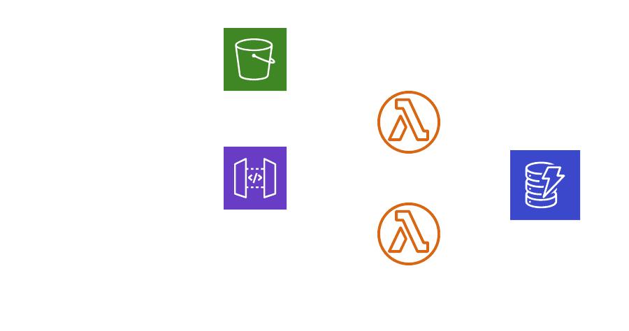

---

# Common Backend System Architectures

## Serverless

### Pros

- No server management is required.

---

# Common Backend System Architectures

## Serverless

### Pros

- Costs based on usage, not on pre-purchased capacity.

---

# Common Backend System Architectures

## Serverless

### Pros

- Automated scaling.

---

# Common Backend System Architectures

## Serverless

### Cons

- The architecture can be more expensive for long-term applications.

---

# Common Backend System Architectures

## Serverless

### Cons

- Testing can be difficult due to the environment's reliance on the Internet.

---

# Common Backend System Architectures

## Serverless

### Cons

- Troubleshooting and debugging is also more complex.

---

# Common Backend System Architectures

## Serverless

### Use Cases

- **Real-time file processing:** As soon as a file is uploaded in S3, AWS Lambda can trigger a function to process it.

---

# Common Backend System Architectures

## Serverless

### Use Cases

- **Real-time stream processing:** Perform real-time analytics on data streams using Kinesis.

---

# Common Backend System Architectures

## Serverless

### Use Cases

- **Extract, transform, load (ETL):** Perform ETL on demand. For example, when a new file is uploaded to S3, AWS Lambda can trigger to process the data and load it into a database.

---

# Common Backend System Architectures

## Serverless

### Use Cases

- **Websites:** Websites that are purely static (HTML, CSS, JavaScript) can be served from S3 directly.

---

# Evolution of Backend System Architectures

---

# Evolution of Backend System Architectures

## Start with Monolith

Most companies and/or projects start with a monolith design for the same benefits mentioned earlier:

- Simplicity
- Consistency
- Efficiency

---

# Evolution of Backend System Architectures

## Start with Monolith

---

# Evolution of Backend System Architectures

## Split to Services

After a company or project grows there begins the need to "split out" functional logic into units for the following benefits:

- Independent Development
- Independent Deployment
- Fault Isolation

---

# Evolution of Backend System Architectures

## Split to Services

---

# Evolution of Backend System Architectures

## Save with Serverless

After starting with a monolith, then separating logic with services, a system can further benefit from serverless for:

- No infrastructure management (saves operations costs)
- Costs based on usage (saves resource costs)
- Automated scaling (saves scaling challenges)

---

# Evolution of Backend System Architectures

## Save with Serverless

---

# Who uses Backend System Architectures?

---

# Who uses Backend System Architectures?

## Amazon

Utilizes a microservices architecture to manage its vast operations. Each microservice functions independently, facilitating teams to modify their services without affecting others. This approach has propelled Amazon's scalability and innovation.

---

# Who uses Backend System Architectures?

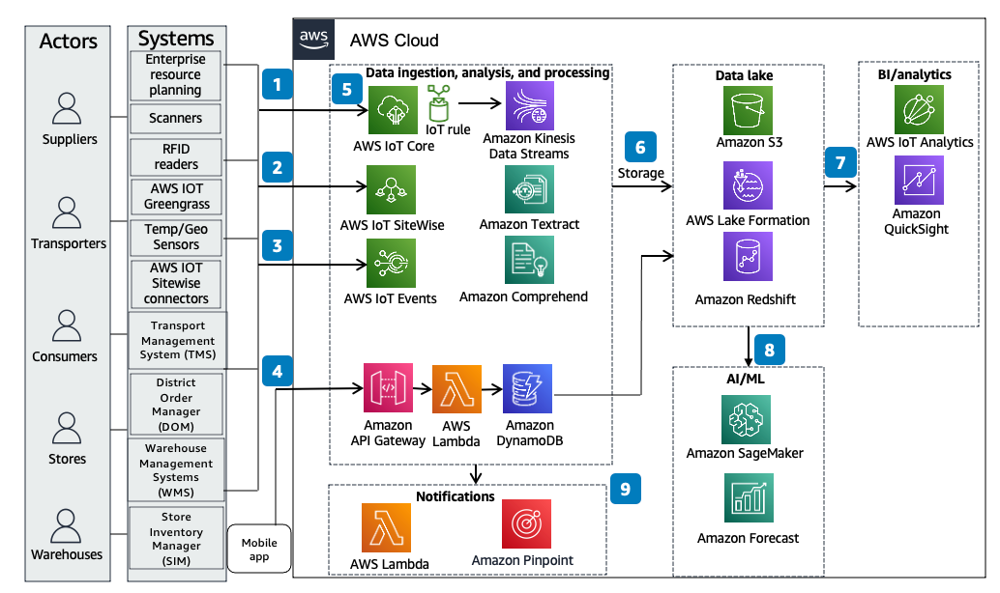

---

# Who uses Backend System Architectures?

## Netflix

Netflix employs a hybrid of serverless and microservices architectures to provide streaming services to millions of users globally. This architecture enables Netflix to manage enormous traffic surges and deliver a smooth user experience.

---

# Who uses Backend System Architectures?

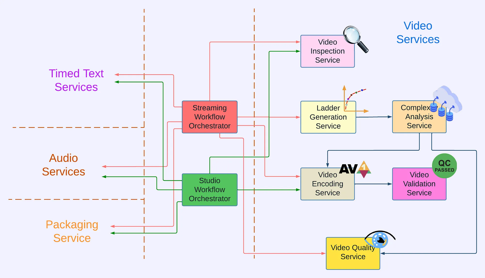

---

# Who uses Backend System Architectures?

## Netflix Cosmos

Cosmos is a computing platform that combines the best aspects of microservices with asynchronous workflows and serverless functions.

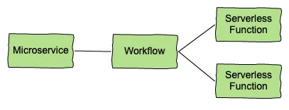

---

# Who uses Backend System Architectures?

## Google

Google's search backend engine uses concepts such as monolithic architecture, service-oriented architecture (SOA), and microservices, each of which represents stages in the evolution of backend architectures.

---

# Who uses Backend System Architectures?

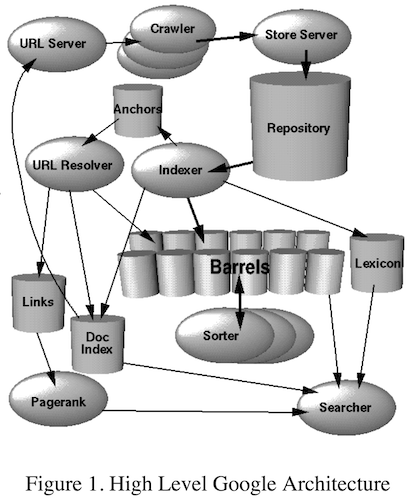

---

# Who uses Backend System Architectures?

## Uber

As it expanded worldwide, Uber transitioned from a monolithic to a microservices architecture. Each service, such as ride-hailing, food delivery, and driver-partner services, is managed by a separate microservice. This has enabled Uber to scale and customize its services for different markets.

---

# Who uses Backend System Architectures?

---

# Backend Systems Design: Architecture

## Conclusions

### Importance of Systematic Planning

Effective architecture design is foundational to project success. Emphasize the necessity of thorough planning and understanding of both stakeholder needs and technological capabilities before initiating development.

> This ensures alignment with business objectives and user requirements, optimizing both functionality and efficiency.

---

# Backend Systems Design: Architecture

## Conclusions

---

# Backend Systems Design: Architecture

## Conclusions

### Flexibility and Scalability are Key

In the ever-evolving landscape of technology and business, designing architecture with flexibility and scalability at its core is crucial.

> These allow a system to adapt to changes in user demand and technological advancements without requiring complete redesigns, thereby saving time, resources, and facilitating sustained growth.

---

# Backend Systems Design: Architecture

## Conclusions

### Continuous Learning and Adaptation

The field of architecture design is dynamic, with new challenges and solutions emerging regularly. Embrace a mindset of continuous learning and openness to innovation.

> This approach will not only keep your skills relevant but also enable you to design systems that are robust, adaptable, and forward-thinking.

---

# Backend Systems Design: Architecture

## Thank you for watching!

Find me online:

- Engineering Blog: https://altf4.blog
- Twitch: https://www.twitch.tv/thealtf4stream
- Twitter: https://www.x.com/thealtf4stream
- YouTube: https://www.youtube.com/thealtf4stream
